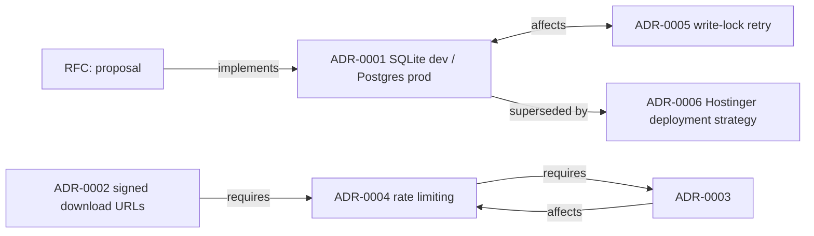

# Architecture Decision Graph

The relation map of every architecture decision. Each node is an ADR (or a
pending RFC); each edge is one of four relations. The graph is **derived** from
the ADR/RFC records (`governance/adr/`, `governance/rfc/`) — it never defines a
new decision.

## Relations

| Edge | Meaning |
|---|---|
| `implements` | a decision implements what an RFC proposed |
| `affects` | changing/reviewing one decision must consider another |
| `superseded by` | a decision has been replaced by a newer one (old file keeps a pointer) |
| `requires` | one decision only makes sense given another |

## Graph

## Decision list

| # | Decision | Edges | Notes |
|---|---|---|---|
| RFC-* | (none yet — RFC directory has README + TEMPLATE only) | — | First RFC triggers the Decision Engine |
| ADR-0001 | SQLite dev / Postgres production split | affects ADR-0005; superseded by ADR-0006 | Dev uses SQLite, so the write-lock story matters in dev; production DB is now MySQL |
| ADR-0002 | Private document downloads via signed, expiry-gated URLs | requires ADR-0004 | Signed URL endpoints are rate-limited |
| ADR-0003 | Proxy-aware client IP resolution | affects ADR-0004 | Rate limiting keys off the real client IP |
| ADR-0004 | Rate limiting on auth and downloads | requires ADR-0003 | Needs trustworthy client IP to key limits |
| ADR-0005 | SQLite write-lock retry for concurrent booking | affects ADR-0001 | Retry mitigates dev-mode write locks |
| ADR-0006 | Production deployment strategy — Hostinger shared hosting | supersedes ADR-0001 | Passenger + MySQL + in-memory cache; CI mirrors MySQL |

## Rules
1. No edge exists without a record; a decision not in the graph is unrecorded.
2. `superseded by` is the only relation that rewrites the old record — and it
   only adds a pointer line, never rewrites content.
3. When a new ADR lands, the graph is re-validated (ontology rule 3).
4. The Business Completeness Gate cross-checks: any `P`-level policy referencing
   an ADR appears here.
