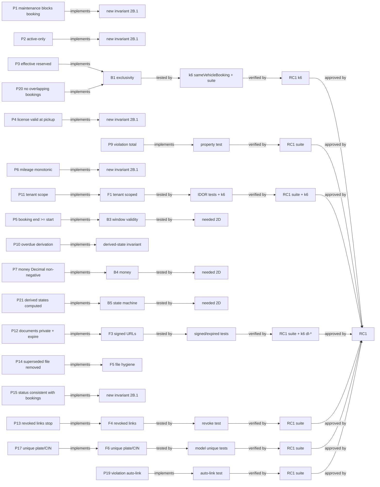

# Vroom — Policy Graph

The end-to-end proof chain for every policy: **Policy → Rule → Invariant →
Test → Evidence → Release**. A live snapshot of how far each policy is proven,
in graph form. Derived from `domain/model/policies.md` + the traceability
snapshot (`verification/traceability/vroom-rc1.md`).

## Chain

```text
P* ──implements──▶ Invariant ──tested by──▶ Test ──verified by──▶ Evidence ──approved by──▶ RC1
```

## Graph



## Read it as
- **Green chain** (B1/B3/B4/B5/F1/F3/F4/F6 + derived-state tests) → proven to
  RC1.
- **Red dotted edge** (`tested by needed 2D`) → owned gap (G1–G8), not silence.
- **Broken `implements` edge** (`new invariant 2B.1`) → Phase 2A validated policy
  still in prose only — this is the release blocker set (P1, P2, P4, P6, P15).
- **Proposed policies** (P8, P16, P18) have no `implements` edge until the
  Decision Engine answers them.

## Invariants referenced
| Invariant | Policies | Tests | Evidence | Status |
|---|---|---|---|---|
| B1 exclusivity | P3, P20 | k6 `sameVehicleBooking`; adjacent-window unit needed (G5) | RC1 k6 | ⚠️ |
| B2 tenant | P11 | IDOR/cross-tenant tests | RC1 suite + k6 | ✅ |
| B3 window validity | P5 | needed (G1) | — | ⚠️ |
| B4 money | P7 | needed (G2) | RC1 suite (pricing) | ⚠️ |
| B5 state machine | P21 | needed (G3) | — | ⚠️ |
| B6 PROTECT | — | needed (G4) | — | ⚠️ |
| F1 tenant scoped | P11 | model tests | RC1 suite | ✅ |
| F2 cross-tenant | P11 | IDOR + k6 | RC1 suite + k6 | ✅ |
| F3 signed URLs | P12 | signed/expired/tampered tests | RC1 suite + k6 `dl-*` | ✅ |
| F4 revoked links | P13 | revoke test | RC1 suite | ✅ |
| F5 file hygiene | P14 | needed (G6) | — | ⚠️ |
| F6 unique plate/CIN | P17 | model tests | RC1 suite | ✅ |
| maintenance-due derived | P15 | needed (G7) | — | ⚠️ |
| violation derived-state | P10 | needed (G8) | — | ⚠️ |
| auto-link behavior | P19 | auto-link test | RC1 suite | ✅ |

Maintained as part of Phase 2B/2C; regenerated from `policies.md` + test
matrices each stage.
